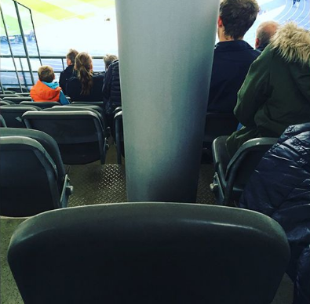

## Things you need to know about Beacons

____
____
____
____

____
____
____
____

____
____

Fließtext:

Jeder von euch wird das „Olympia-Stadion“ in Berlin kennen.
Nehmen wir also ihr habt im letzten Moment relativ glücklich eine Karte für das DFB-Pokalfinale ergattern können. 
Das ist euer erster Besuch im Stadion, dementsprechend seid ihr durch die Menschenmassen ein wenig verblüfft und verwirrt, achtet nicht auf die Markierungen für die Sitzplätze und braucht eine gefühlte Ewigkeit euren Platz zu finden.

Schön und gut ihr seid endlich am Ziel – euer Sitzplatz fürs Finale..sieht dann so aus.
Klasse denkt ihr euch, anscheinend hatten das Olympia-Stadion und der Berliner Flughafen dasselbe Planungsteam.
Euch wird bewusst – ihr seid im Stadion und viel an eurem Sitzplatz könnt ihr jetzt auch nicht mehr ändern.
Vor lauter Wut und Enttäuschung werdet ihr hungrig und wollt wenigstens vorm Spiel noch schnell eine Bratwurst kaufen, also sucht ihr den nächsten Stand..und dürft dann feststellen, dass anscheinend noch mehr Leute auf die gleiche Idee gekommen sind, sich ein Engpass für Würstchen gebildet hat und ihr keine mehr bekommen könnt.

Ende vom Lied ihr habt Ewigkeiten gebraucht euren Platz zu finden, seid unglaublich unzufrieden mit eurem momentanen Platz und habt die ersten paar Minuten verpasst weil ihr einen andren Bratwurststand suchen musstet.

Diese Probleme lassen sich mithilfe von einer bestimmten Technik umgehen.
Dem Beacon.

* Was ist ein "Beacon"?

    - Bedeutet übersetzt "Leuchtfeuer / Leuchtturm" und funktioniert auch exakt so.
      Das "i" vor den Namen beschreibt einfach nur die Zugehörigkeit dieser Produkte zu Apple, welche die Beacons nun seit 2013 
      vertreiben.
    - Ähnlich wie der Leuchtturm ist ein Beacon sich seiner exakten Umgebung nicht bewusst, sondern sendet lediglich ein Signal über
      seinen Standpunkt aus. - Die Schiffe sehen zwar den Leuchtturm, dieser aber nicht die Schiffe.
      Was beim Leuchtturm eben diese Schiffe sind, sind beim Beacon Bluetooth-kompatible Geräte.
      Ein Beacon ist aber natürlich auch wesentlich kleiner als ein "handelsüblicher" Leuchtturm, Tobias hat ein paar seiner eigenen 
      Beacons zu Demonstrationszwecken bereitgestellt! 
      
    - Bleiben wir beim Beispiel des Stadions, von solchen Beacons wurden beispielsweise im "Levi-Stadium" in Kalifornien in  geregelten 
      Abständen von ungefähr 30 Metern, insgesamt mehr als 2000 Stück angebracht.
      Wieso so viele und wozu erkläre ich anhand ihrer Funktionsweise im nächsten Schaubild.

* Funktionsweise eines "Beacons"?

    - Hier sehen wir verschiedene Arten von Datenübertragung in Zusammenhang mit der Akkulaufzeit und der möglichen Entfernung.
      Wie ihr sicher noch von letzter Woche wisst, ist RFID eine scannbare und damit sehr nahe Form der Datenübertragung via 
      Radiowellen.
      Das ihr hoffentlich noch nie versucht habt eure Thoska stromtechnisch aufzuladen liegt schlicht daran, dass der RFID Chip sich bei 
      jeder Interaktion mit einem Scangerät erneut auflädt. Der Akkuverbrauch ist also quasi nicht gegeben.
      
      Auf der ganz anderen Seite haben wir das GPS, das „Global Positioning System“. 
      Wie die meisten von euch wissen werden funktioniert das via Satellitensignalen und damit auf riesige Entfernung relativ genau - 
      und verbraucht extrem viel Akku.
Wer seinen Trainerjob zu PokemonGo-Zeiten ernst genommen hat, wird wissen wovon ich rede und einen externen Akku zuhause liegen haben.
      
Die Beacons senden auf Basis der sogenannten BLE-Technik. (Bluetooth-Low-Energy)
      Die maximale Reichweite dieser Technik variiert bei Beacons zwischen einer handvoll Metern bis hin zu 70, je nach Beacongröße.
      Die Genauigkeit und Akkulaufzeit hängt ebenfalls davon ab, wie stark das Signal gesendet werden soll.
      
* Wozu wollen wir dann über 2000 Beacons in einem Stadion?
      
    - Der Beacon sendet also ein Bluetooth-Signal mit seinem Standpunkt an alle umliegenden Geräte die dieses empfangen können.
      Um dieses Signal überhaupt empfangen zu können benötigt ihr entsprechende Apps auf euren Handys.
      In unserem Beispiel die App des Stadions.
      Diese App sendet die empfangenen Signale und damit eure Entfernung zu den einzelnen Beacons zu einem Server, der diese dann 
      verarbeitet und eure Position bestimmen kann. Ihr seht, je mehr Beacons umso genauer die Verarbeitung.
      
      So könnt ihr nach wenigen Sekunden im Stadion direkt via App zu eurem Sitzplatz geführt werden.
      Beacons können euch auch darauf aufmerksam machen, dass noch ein besserer Platz zur Verfügung steht der nicht weit von eurem 
      entfernt ist.
Oder euch zu einem anderen Hotdog-Stand schicken, wenn bei einem die Hotdogs ausgehen.

An sich bringen Beacons etliche marketingtechnische und besonders servicetechnische Vorteile mit sich.
      
Aber keine Sorge, weder ihr noch eure Daten sind durch Beacons gefährdet. Die Bluetoothstrahlung der BLE-Technik ist auch in 
Masse absolut unbedenklich, zudem können Beacons  keine Daten empfangen, sie sind mit keinem Gerät direkt verbunden und dienen nur 
der Signalausbreitung.
      
Inwiefern Beacons noch benutzt werden und welche Möglichkeiten sich darüber hinaus bieten dürft ihr gleich in einer Gruppenarbeit 
herausfinden.
Da wir wissen wie sehr ihr alle das aufstehen und nach vorne kommen liebt, haben wir uns dafür entschieden euch davon zu 
verschonen.
Stattdessen dürft ihr im github eure Ergebnisse eintragen und wir screenen sie an, damit sie auch jeder lesen und sehen kann.

* Video: Things you need to know about Beacons

see [YouTube video - 10 Things you need to know about Beacons](https://www.youtube.com/watch?v=L44m7otNI7o)
