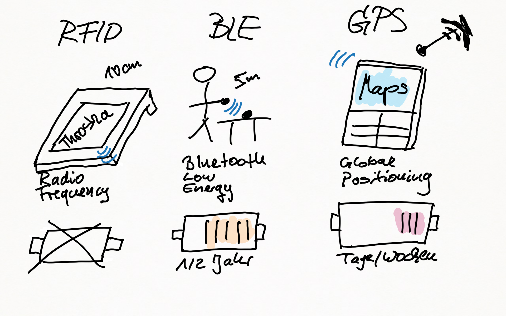
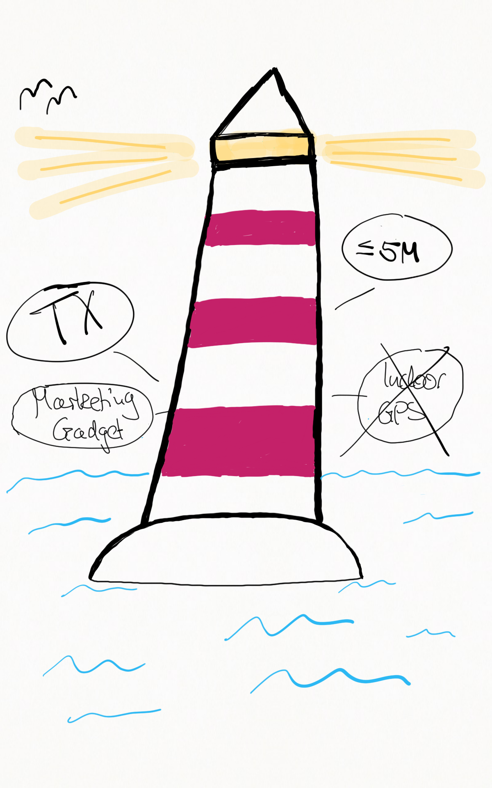

# iBeacon Workshop

Learning session für das Modul eCommerce 2018 @ Uni Jena.

## Road map
* 10 Minuten Things you need to know about Beacons (Theo)
* 10 Minuten Brainstorming in den Gruppen (Jann)
* 10 Minuten Kurze Vorstellung der Gruppen
* 10 Minuten use case (Tobias)
* 5 Minuten Take away / Fazit (Jann)

## Things you need to know about Beacons

* Beacon vs. iBeacon vs. eBeacon

* Things you need to know about Beacons

see [YouTube video - 10 Things you need to know about Beacons](https://www.youtube.com/watch?v=L44m7otNI7o)

## Brain storming

Bitte bearbeitet in den nächsten 10 Minuten folgende Fragestellungen in den Gruppen pro Reihe.

Jede Reihe eine Gruppe 1-8.

__Folgende personelle Einteilung:__ Vortragender ist der ganz rechts sitzende. GitHub-Editor ist der ganz links sitzende. Die Personen in der Mitte haben beratende Funktion.

### Fragen

* Welches Beacon Produkt bietet Asandoo an?
* Was ist Bluejacking?
* Wie steht es mit Datensicherheit und Beacons
* Wie können Beacons in Supermärkten eingesetzt werden?

IKEA Video?

* Wie können Beacons in der Tourismusbranche genutzt werden?
* Welches Beacon Produkt bietet Airfy an?
* Welches Beacon Produkt bietet Barcoo an?
*  (bekommt es wie bei Marek extra dicke!)

## Real World Use Case 

_Infos über mein reales BLE Projekt_

* Kunde: "Altenheim-Kette" im süddeutschen Raum, mehr als 15 Standorte
* __Problem:__ Bewohner ( z.T. mit altersbedingten Handicaps ) "gehen verloren", d.h. ihr fernbleiben wird viel zu spät bemerkt.
* __Folge:__ Sehr teure Suchaktionen mit Helikopter-Einsätzen, Suchmannschaften, etc.
* __weitere Folge:__ schlechte Presse, Image Schäden
* __Idee:__ "Weiche" Eingangs-/Ausgangstracking via Beacons. Warnmeldung, falls Bewohner lange nicht zurück.

### node.js /socket.io

### Use Case Outcome

* Prototyp funktioniert zu 95%
* Verbesserung mittels schlauer Datenstruktur denkbar
* Kein echtes Indoor-GPS möglich (Signal zu leicht beeinflussbar)

### What did we learn / Take home messages 

via [Menti](https://www.menti.com/)

* Was ist die richtige deutsche Übersetzung von Beacon?

A) Schinken
B) Leuchtturm

* Kann ein Beacon Daten empfangen?

A) Ja
B) Nein

* Die Reichweite von Beacons beträgt ungefähr...

A) 10cm
B) 5 m
C) 1 Km

### Handout / Take away ###

Mit folgendem Link könnt ihr den Text dieser Datei als PDF erstellen lassen und anschließend ausdrucken:

* https://gitprint.com/ibeacon-projekt/ibeacon-projekt/blob/master/README.md
