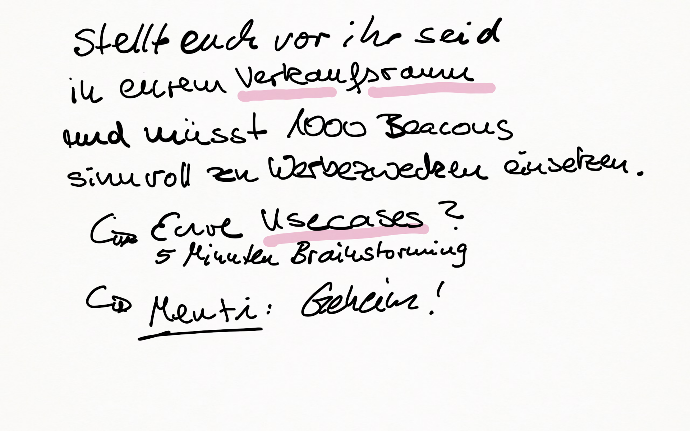
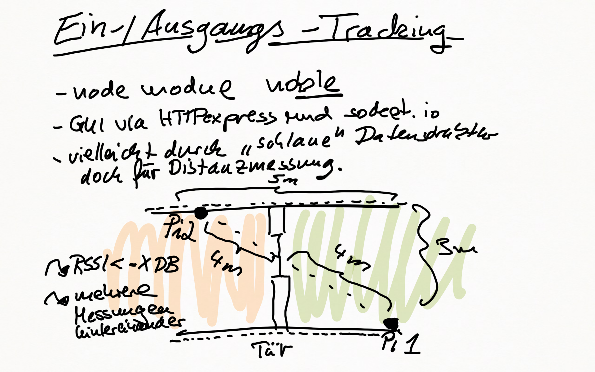
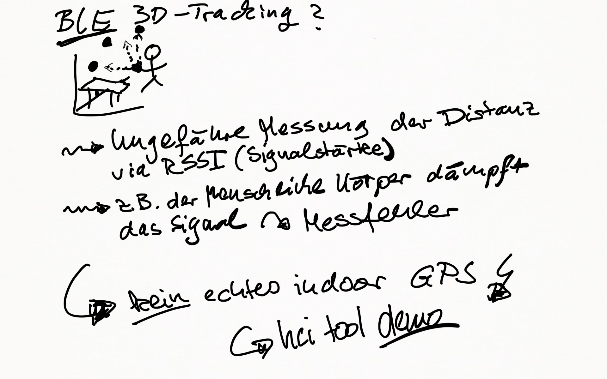
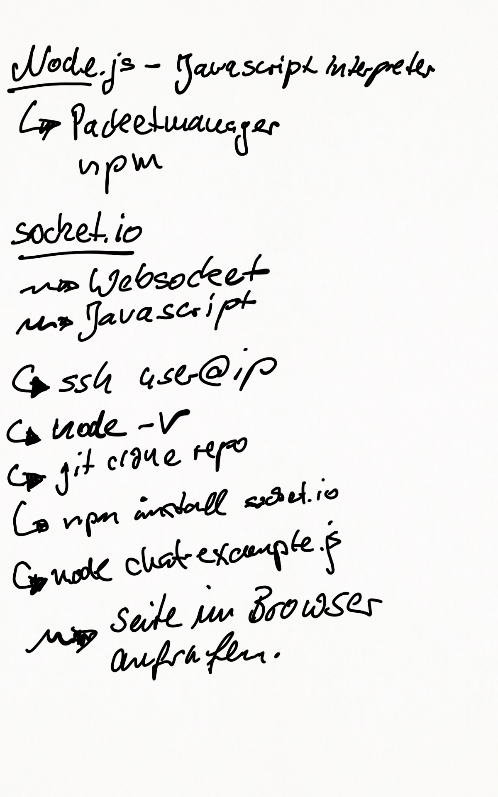

# iBeacon Projekt
Learning session for the module eCommerce 2018 at Uni Jena.

## Road map
* 10 Minuten Beacon Vorstellung von uns. (Theo)
* 10 Minuten Brainstorming in den Gruppen (Jann)
* 10 Minuten Kurze Vorstellung je Gruppe
* 10 Minuten use case (Tobias)
* 5 Minuten Take away / Fazit (Jann)

## Beacon Vorstellung

* Beacon vs. iBeacon vs. eBeacon

* Things you need to know about Beacons

see [YouTube video - 10 Things you need to know about Beacons](https://www.youtube.com/watch?v=L44m7otNI7o)

## Brain storming
Bitte bearbeitet in den nächsten 10 Minuten folgende Fragestellungen in den Gruppen pro Reihe.

Jede Reihe eine Gruppe 1-8.

_Folgende personelle Einteilung:_ Vortragender ist der ganz rechts sitzende. GitHub-Editor ist der ganz links sitzende. Die Personen in der Mitte haben beratende Funktion.

### Fragen

* Welches Beacon Produkt bietet Asandoo an?
* Was ist Bluejacking?
* Wie steht es mit Datensicherheit und Beacons
* Wie können Beacons in Supermärkten eingesetzt werden?
* Wie können Beacons in der Tourismusbranche genutzt werden?
* Welches Beacon Produkt bietet Airfy an?
* Welches Beacon Produkt bietet Barcoo an?
*  (bekommt es wie bei Marek extra dicke!)

## use case

* Infos about own real world project

* node.js and socket.io was used for the beacon tracking project. --> Facts.

### node.js /socket.io

* raspberry pi interactive learning session to give the students an idea about node.js and socket.io

### What did we learn / Take home messages 

via [Menti](https://www.menti.com/)

## Deadlines
* 29.5. 14:00 Uhr - Learning session (45 Minuten)

## Meetings
* ~~03.5. 12:00 Uhr s.t. - Erstes Brainstorming (direkt nach der eCommerce VL)~~
* 17.5. 12:00 Uhr
* 22.5. 16:00 Uhr
* 24.5. 12:00 Uhr

## TODOs
* create flip chart slides
* create hand out
* create learning session
* test a full session
