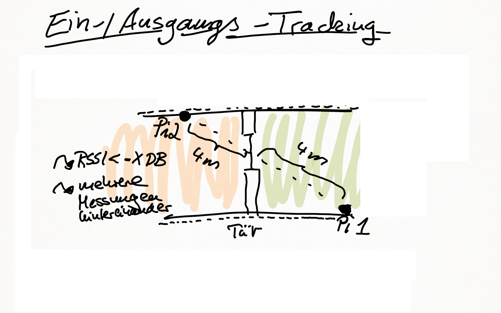
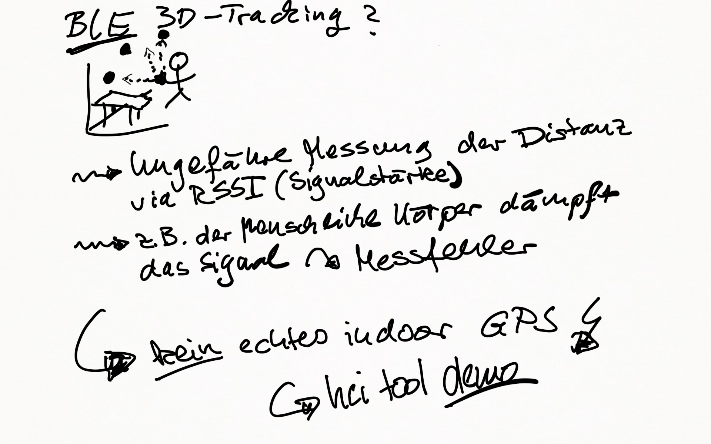
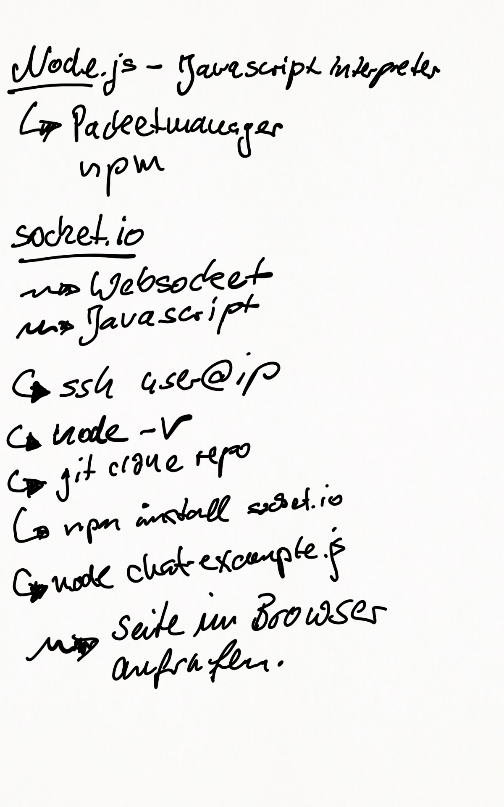

# Real World Use Case 

_Infos über mein reales BLE Projekt_

* __Kunde:__ "Altenheim-Kette", mehr als 15 Standorte

* __Problem:__ Bewohner ( z.T. mit altersbedingten Handicaps ) "gehen verloren", d.h. ihr fernbleiben wird viel zu spät bemerkt.

* __Folge:__ Sehr teure Suchaktionen mit Helikopter-Einsätzen, Suchmannschaften, etc.

* __weitere Folge:__ schlechte Presse, Image Schäden

* __Idee:__ "Weiche" Eingangs-/Ausgangstracking via Beacons. Warnmeldung, falls Bewohner lange nicht zurück.

## node.js /socket.io

## Use Case Outcome

* Prototyp funktioniert zu 95% (manchmal ist das Signal zu schwach, da Beacon-Signal vom Körper gedämpft)
* Verbesserung mittels schlauer Datenstruktur denkbar
* Kein echtes Indoor-GPS möglich (Signal zu leicht beeinflussbar)
* Rechtliche Rahmenbedingungen müssen vom Kunden definiert werden

## Links / Weiterführende Materialien

* [Projekt Github Repo] https://github.com/tobiasweede/BeaconWatch
* [Reference Project](https://blog.truthlabs.com/beacon-tracking-with-node-js-and-raspberry-pi-794afa880318)
* [NodeJS Website](https://nodejs.org/)
* [NodeJS Example](https://www.nodebeginner.org/#hello-world)
* [Understand NodeJS Debug](https://www.npmjs.com/package/debug)
* [Noble Bluetooth Suite Website](https://github.com/sandeepmistry/noble)
* [Socket.IO Website](https://socket.io/)
* [Understand Socket.IO Suite](http://www.programwitherik.com/socket-io-tutorial-with-node-js-and-express/)
* [Understand RSSI](https://blog.bluetooth.com/proximity-and-rssi/)
