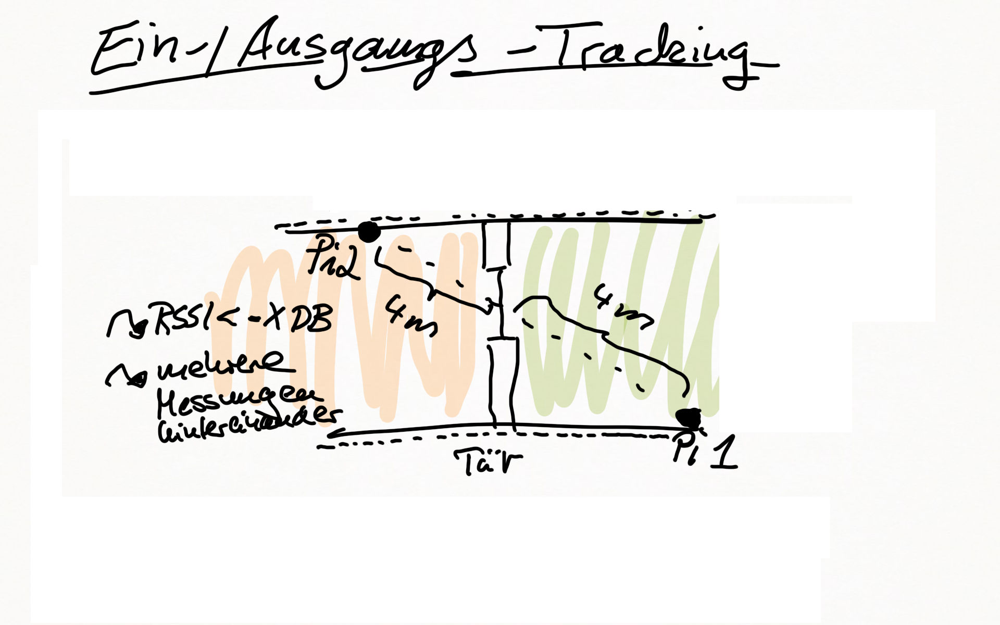
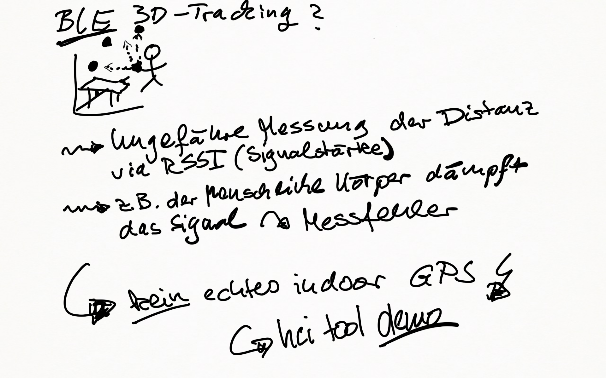

# Use Case 

_Bericht über mein BLE Projekt_

* __Kunde:__ "Kette von Seniorenzentren", mehr als 15 Standorte

* __Problem:__ Bewohner ( z.T. mit altersbedingten Handicaps ) "gehen verloren", d.h. ihr fernbleiben wird viel zu spät bemerkt.

* __Folge:__ Sehr teure Suchaktionen mit Helikopter-Einsätzen, Suchmannschaften, etc. zur Folge.

* __weitere Folge:__ schlechte Presse, Image Schäden

* __Idee:__ "Weiche" Eingangs-/Ausgangstracking via Beacons. Warnmeldung, falls Bewohner lange nicht zurück.






## node.js /socket.io


## BeaconWatch

* GUI


Step 3 - Check website via App

## Use Case Outcome

* Prototyp funktioniert zu 95% (manchmal ist das Signal zu schwach, da Beacon-Signal vom Körper gedämpft)
* Verbesserung mittels schlauer Datenstruktur denkbar
* Kein genaues Indoor-GPS möglich (Signal zu leicht beeinflussbar)
* Rechtliche Rahmenbedingungen müssen vom Kunden definiert werden
* Bewegende (Akkubetriebene) "von der Stange" Beacons insb. ungenau!

## Lessons learned

* Die Reichweite und Bateriegroße sind klar die limitierenden Faktor
* Dennoch deutlich kleiner als GPS (das eine SIM-Karte benötigt -> laufende Kosten!)
* Raspberry heutzutage für alles zu gebrauchen. Vorteil durch Standardisierung.
* node.js als einfach Methode zum Prototypen
* Vieles kann über Websockets abgebildet werden. Auch andere Prozesse (siehe ERP-Anbindungen, Wetterdaten, IoT, You name it).
* Rechtliche Situation nicht ganz einfach - moralische Frage.

## Falls wir noch viel Zeit haben

* URL Broadcast Demo

Step 1 - Enably BLE Advertising:
```
sudo hciconfig hci0 leadv 3
```

Step 2 - Set payload:
```
sudo hcitool -i hci0 cmd 0x08 0x0008 1b 02 01 06 03 03 aa fe 13 16 aa fe 10 00 03 74 6f 62 69 61 73 2d 77 65 69 73 73 08 00 00 00 00
```

## Links / Weiterführende Materialien

* [Projekt Github Repo](https://github.com/tobiasweede/BeaconWatch)
* [Reference Project](https://blog.truthlabs.com/beacon-tracking-with-node-js-and-raspberry-pi-794afa880318)
* [NodeJS Website](https://nodejs.org/)
* [NodeJS Example](https://www.nodebeginner.org/#hello-world)
* [Understand NodeJS Debug](https://www.npmjs.com/package/debug)
* [Noble Bluetooth Suite Website](https://github.com/sandeepmistry/noble)
* [Socket.IO Website](https://socket.io/)
* [Understand Socket.IO Suite](http://www.programwitherik.com/socket-io-tutorial-with-node-js-and-express/)
* [Understand RSSI](https://blog.bluetooth.com/proximity-and-rssi/)
* [Bluetooth Advertising Howto](https://webgazer.org/update/tutorial/2016/03/16/raspberrypi-eddystone-url.html)
